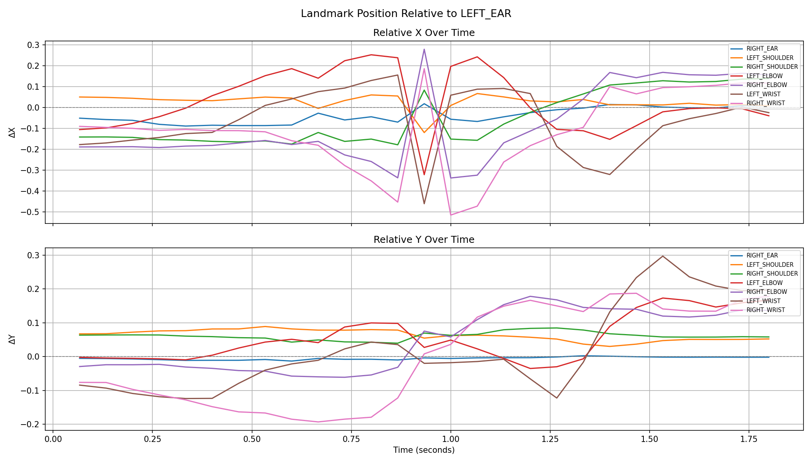
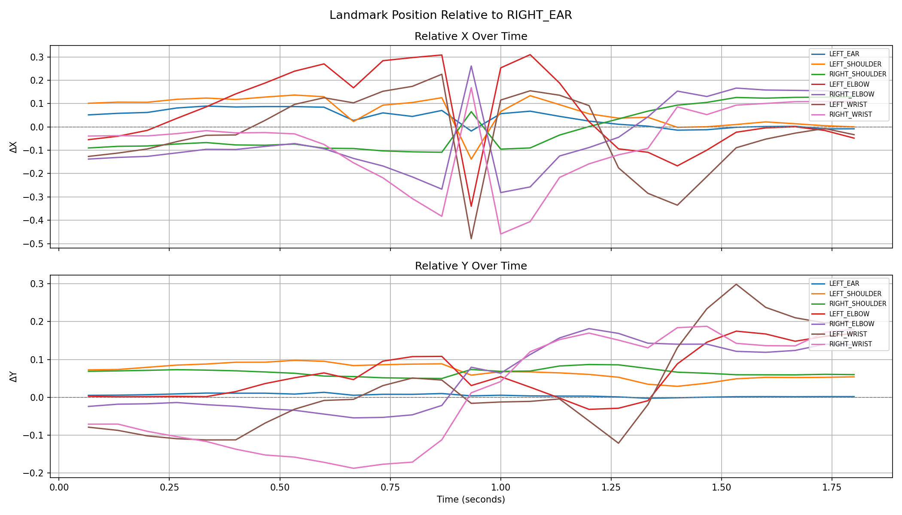

# Volleyball Form Grader
Currently analyzes **ARM SWING ONLY** does not grade

**last update - 2026-03-13**

---

## Demo Plots

These plots show where each joint is relative to Yuji Nishida's head over a ~2 second clip (12 fps, 27 frames). 

**Relative to Left Ear**  

**Relative to Right Ear**  

---

## How It Works

1. **Video Ingestion** – Samples frames from a clip at 12 fps.
2. **Pose Estimation** – MediaPipe Pose picks up 33 body landmarks per frame with (x, y, z) coords and visibility scores.
3. **Landmark Filtering** – Only keeps the upper-body joints that matter for volleyball:
   - `LEFT_EAR`, `RIGHT_EAR`
   - `LEFT_SHOULDER`, `RIGHT_SHOULDER`
   - `LEFT_ELBOW`, `RIGHT_ELBOW`
   - `LEFT_WRIST`, `RIGHT_WRIST`
4. **Relative Positioning** – Converts positions to ΔX/ΔY deltas relative to each ear so overall body movement doesn't throw off the data.
5. **Data Export** – Saves everything to `pose_data.json` with timestamps and visibility scores per frame.
6. **Plotting** – Generates time-series plots anchored to each ear showing how every joint moves in X and Y through the drill.

---

## Tracked Landmarks (Example Frame)

| Landmark | x | y | z | Visibility |
|---|---|---|---|---|
| LEFT_EAR | 0.7682 | 0.3909 | -0.1307 | 0.9999 |
| RIGHT_EAR | 0.7167 | 0.3858 | 0.1234 | 0.9999 |
| LEFT_SHOULDER | 0.8180 | 0.4582 | -0.2958 | 0.9996 |
| RIGHT_SHOULDER | 0.6264 | 0.4544 | 0.2373 | 0.9996 |
| LEFT_ELBOW | 0.6621 | 0.3886 | -0.5386 | 0.9989 |
| RIGHT_ELBOW | 0.5788 | 0.3616 | 0.0153 | 0.9760 |
| LEFT_WRIST | 0.5901 | 0.3067 | -0.4064 | 0.9892 |
| RIGHT_WRIST | 0.6774 | 0.3148 | -0.2320 | 0.9523 |

All coordinates are normalized to `[0, 1]` relative to the video frame.

---

## Credits

- Demo footage: [**【必見】プロがバレーボール上達させます！/ 西田有志 Yuji Nishida**](https://www.youtube.com/watch?v=WeOIWJ5KmgY)
